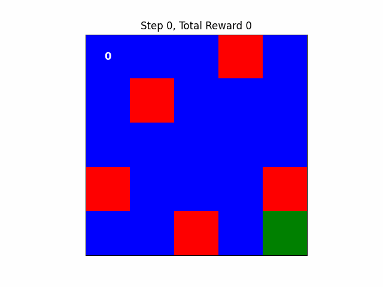

# 🤖 Reinforcement Learning Agent (Monte Carlo, Q-Learning, SARSA)

## 📌 Overview

This project demonstrates the implementation and training of a Reinforcement Learning (RL) agent using three fundamental algorithms:

* Monte Carlo Learning
* Q-Learning
* SARSA (State-Action-Reward-State-Action)

The goal of this project is to understand how different RL techniques learn optimal policies through interaction with an environment and compare their performance.

---

## 🧠 Algorithms Implemented

### 1️⃣ Monte Carlo Learning

Monte Carlo methods learn by:

* Running complete episodes
* Updating value estimates based on total returns
* Averaging results over multiple episodes

**Key Characteristics:**

* No bootstrapping
* Requires episode completion
* Works well in episodic environments

---

### 2️⃣ Q-Learning (Off-Policy)

Q-Learning is an **off-policy** algorithm that learns the optimal policy regardless of the agent's actions.

**Update Rule:**
Q(s, a) ← Q(s, a) + α [r + γ max Q(s', a') − Q(s, a)]

**Key Features:**

* Uses greedy policy for learning
* Converges to optimal policy
* Independent of behavior policy

---

### 3️⃣ SARSA (On-Policy)

SARSA is an **on-policy** algorithm that learns based on the agent’s actual actions.

**Update Rule:**
Q(s, a) ← Q(s, a) + α [r + γ Q(s', a') − Q(s, a)]

**Key Features:**

* Safer learning (follows current policy)
* More conservative than Q-Learning
* Useful in risky environments

---

## ⚙️ Environment

* The agent interacts with a defined environment (e.g., grid world / game / simulation).
* The environment provides:

  * States
  * Actions
  * Rewards

---

## 🚀 How It Works

1. Initialize Q-values (or value functions)
2. Agent interacts with environment
3. Receives reward and next state
4. Updates values using selected algorithm
5. Repeats over multiple episodes
6. Learns optimal policy over time

---

## 📊 Comparison of Algorithms

| Feature       | Monte Carlo    | Q-Learning | SARSA        |
| ------------- | -------------- | ---------- | ------------ |
| Policy Type   | On-policy      | Off-policy | On-policy    |
| Update Timing | End of episode | Every step | Every step   |
| Stability     | Medium         | High       | Safer        |
| Exploration   | Required       | Flexible   | Policy-based |

---

## 🛠️ Tech Stack

* Language: JavaScript / Python (update as per your project)
* Concepts: Reinforcement Learning, Markov Decision Processes

---

## 📈 Results

* The agent successfully learns optimal actions over time.
* Q-Learning converges faster but can be riskier.
* SARSA provides more stable learning.
* Monte Carlo performs well in episodic tasks.

---
### Agent trained using Off policy and on-policy algorithms
<p align="center">
  
</p>

### Agent trained using Random policy
<p align="center">
  
</p>

## ▶️ How to Run

```bash
# Clone repository
git clone <your-repo-url>

# Install dependencies
npm install   # or pip install -r requirements.txt

# Run the project
node index.js   # or python main.py
```


## 🙌 Conclusion

This project provides a hands-on understanding of core reinforcement learning algorithms and highlights the differences between on-policy and off-policy learning approaches.

---

